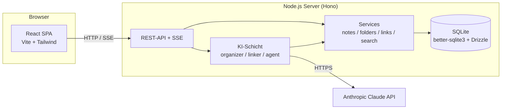
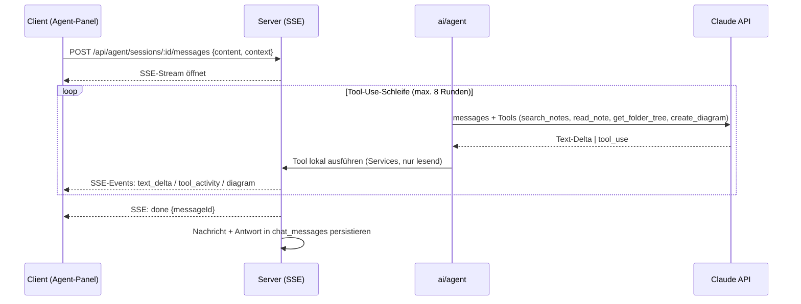

# 03 – Architektur

## Überblick

Klassische Zwei-Schichten-Architektur: React-SPA im Browser, lokaler Node.js-Server mit SQLite. Der Server kapselt Datenhaltung **und** sämtliche KI-Aufrufe (der API-Key verlässt nie den Server). Betrieb lokal auf dem eigenen Rechner (`npm run dev` bzw. später ein Startskript); dieselbe Architektur ist unverändert auf einen Heimserver/VPS übertragbar.



## Tech-Stack mit Begründung

### Frontend (`client/`)

| Baustein | Wahl | Begründung |
|---|---|---|
| Framework | **React 18 + TypeScript + Vite** | Größtes Ökosystem für Editor/Graph-Bibliotheken, schnelle DX. |
| Styling | **Tailwind CSS v4** | Minimalistisches Design-System direkt umsetzbar, Dark Mode trivial. |
| Editor | **TipTap** (ProseMirror) + Markdown-Extension | Live-Markdown-Rendering, erweiterbar für `[[Wiki-Links]]`-Autocomplete (F-14) und Mermaid-Blöcke. |
| Ideen-Graph | **D3-force** auf Canvas (eigene leichte Komponente) | Bei 1 000+ Knoten performanter als SVG/React-Flow; volle Kontrolle über Minimal-Optik. |
| Diagramm-Rendering | **mermaid** (Lazy-Load) | Rendert die Agent-Diagramme (F-43) und Mermaid-Codeblöcke im Editor. |
| Server-State | **TanStack Query v5** | Caching, optimistische Updates (Verschieben, Vorschlag annehmen), Invalidierung. |
| UI-State | **Zustand** | Leichtgewichtig für Panel-Zustände, Auswahl, Theme. |
| Routing | **React Router v7** | Wenige Routen, Standardwahl. |

### Backend (`server/`)

| Baustein | Wahl | Begründung |
|---|---|---|
| Runtime/Framework | **Node.js 22 + Hono** | Hono ist minimal, typisiert, erstklassige SSE-Unterstützung; identische Handler-Signaturen falls später Bun/Edge. |
| Datenbank | **SQLite (better-sqlite3)** + **Drizzle ORM** | Lokale Ein-Datei-DB (E2), synchrone Zugriffe = einfacher Code; Drizzle liefert typsichere Queries + Migrationen. FTS5 für Volltextsuche. |
| Validierung | **Zod** | Request-Validierung; Schemas werden mit dem Client geteilt (`shared/`). |
| KI-SDK | **@anthropic-ai/sdk** | Offizielles SDK, Streaming + Tool-Use. |

### Geteilt (`shared/`)

Zod-Schemas + daraus abgeleitete TypeScript-Typen für alle API-Verträge und Entitäten. Single Source of Truth – Client und Server importieren dieselben Typen.

## Komponenten des Servers

```
server/src/
  index.ts                – Bootstrap: DB öffnen, Migrationen, Hono-App, statische Client-Dateien
  routes/                 – dünne HTTP-Handler, 1 Datei pro Ressource (folders, notes, links, tags, suggestions, search, agent, settings)
  services/               – Geschäftslogik, je Ressource; einzige Schicht mit DB-Zugriff
    folderService.ts      – CRUD, Baum-Aufbau, Zyklen-Check beim Verschieben, Lösch-Strategie (F-04)
    noteService.ts        – CRUD, Autosave, Papierkorb, [[Wiki-Link]]-Sync
    linkService.ts        – Verknüpfungen CRUD, Duplikat-Check (Paar+Typ eindeutig)
    searchService.ts      – FTS5-Suche mit Snippets
    suggestionService.ts  – KI-Vorschläge verwalten (annehmen/ablehnen/Inbox, F-33/34)
    exportService.ts      – Markdown-ZIP-Export (F-16)
  ai/
    provider.ts           – Abstraktion: `complete()`, `streamWithTools()`; einzige Stelle mit @anthropic-ai/sdk (E3)
    organizer.ts          – Auto-Einsortierung (F-30) + Tags/Zusammenfassung (F-32)
    linker.ts             – Verknüpfungsvorschläge (F-31)
    agent.ts              – Kreativ-Agent: Chat-Loop mit Tool-Use, SSE-Streaming (F-40–F-45)
    prompts/              – alle Prompt-Vorlagen als Konstanten (siehe 06-ki-features.md)
  db/
    schema.ts             – Drizzle-Schema (siehe 04-datenmodell.md)
    migrations/           – von Drizzle-Kit generierte SQL-Migrationen
```

**Regeln:**
- Routes validieren (Zod) und übersetzen HTTP ↔ Service; keine Logik.
- Nur Services berühren die DB; die KI-Schicht ruft Services, nie direkt die DB.
- `ai/provider.ts` ist der einzige Ort mit Anbieter-SDK – Austausch des KI-Anbieters ändert genau eine Datei.

## Komponenten des Clients

```
client/src/
  app/                    – Router, Layout (3 Spalten + Agent-Panel), Theme-Provider
  features/
    folders/              – Ordnerbaum (Sidebar), Drag&Drop, Kontextmenüs
    notes/                – Notizliste, TipTap-Editor, Autosave-Hook, Papierkorb
    links/                – „Verbundene Ideen"-Panel, Verknüpfung anlegen-Dialog
    graph/                – Canvas-Graph (D3-force), Filter, Vorschau-Popover
    agent/                – Chat-Panel, SSE-Hook, Mermaid-Renderer, „Als Notiz speichern"
    suggestions/          – Vorschlags-Inbox, Inline-Vorschlagskarten
    search/               – Command-Palette (Ctrl/Cmd+K) mit Suche + Aktionen
    settings/             – Einstellungsseite (F-50)
  shared/                 – API-Client (fetch-Wrapper um shared-Typen), UI-Basiskomponenten, Hooks
```

## Zentrale Datenflüsse

### 1. Neue Notiz → Auto-Organisation (F-30/31/32)

```mermaid
sequenceDiagram
    participant C as Client
    participant S as Server
    participant AI as ai/organizer + linker
    participant A as Claude API

    C->>S: PUT /api/notes/:id (Autosave, letzter Save nach Tipp-Ende)
    S-->>C: 200 (Notiz gespeichert)
    C->>S: POST /api/notes/:id/organize (debounced, nach 3 s Ruhe)
    S->>AI: organize(note)
    AI->>A: 1 Aufruf: Ordnerwahl + Tags + Zusammenfassung (JSON-Ausgabe)
    A-->>AI: {folder, confidence, tags, summary, newFolder?}
    AI->>A: 2. Aufruf: Verknüpfungskandidaten bewerten
    A-->>AI: [{noteId, type, reason, confidence}]
    S->>S: suggestionService: Vorschläge speichern; bei confidence ≥ Schwelle Ordner direkt setzen
    S-->>C: 200 {applied: {...}, suggestions: [...]}
    C->>C: Snackbar „Einsortiert – Rückgängig" bzw. Vorschlagskarten anzeigen
```

Wichtig: `organize` ist **idempotent aufrufbar** und läuft asynchron – die Notiz ist unabhängig vom KI-Ergebnis längst gespeichert (NF-03).

### 2. Kreativ-Agent-Chat (F-40–F-44)



### 3. Ideen-Graph (F-22/23)

`GET /api/graph` liefert ein kompaktes Payload (`nodes: [{id, title, folderRootId, linkCount}]`, `edges: [{source, target, type}]`). Der Client berechnet das Force-Layout im Web Worker, damit die UI flüssig bleibt; Positionen werden sessionweise gecacht.

## Fehler- und Offline-Verhalten

| Situation | Verhalten |
|---|---|
| Kein API-Key / KI deaktiviert | Alle `ai/*`-Endpunkte antworten `409 AI_DISABLED`; Client blendet KI-UI aus (F-35). |
| Claude-Rate-Limit / 5xx | Ein Retry mit Backoff (2 s); danach Vorschlag „später erneut" in der Inbox; nie blockierend. |
| SSE-Abbruch im Chat | Client zeigt „Verbindung unterbrochen – erneut senden"; Session-Verlauf bleibt konsistent (nur vollständig persistierte Nachrichten zählen). |
| Server nicht erreichbar (PWA offline) | Read-only-Ansicht der zuletzt geladenen Notizen aus dem Query-Cache; Schreibaktionen deaktiviert mit Hinweis. |
| DB-Migration nötig | Läuft automatisch beim Serverstart; vorher legt der Server eine Sicherungskopie `notes.db.bak-<timestamp>` an. |

## Sicherheit

- API-Key liegt nur serverseitig (`.env` bzw. per Einstellungs-Endpunkt in der DB, mit AES-verschlüsselter Speicherung; Schlüssel aus lokaler `.env`).
- Server bindet standardmäßig an `127.0.0.1` – kein Zugriff aus dem Netz.
- Alle Eingaben Zod-validiert; Markdown wird beim Rendern sanitisiert (XSS); Mermaid rendert in `securityLevel: 'strict'`.
- An die Claude API gehen nur die minimal nötigen Notiz-Auszüge (Kontextbudget, siehe [06-ki-features.md](06-ki-features.md)).
