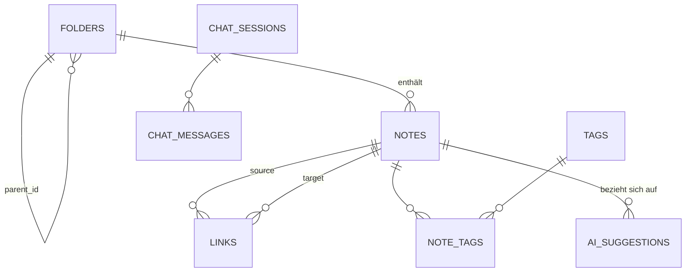

# 04 – Datenmodell

SQLite (WAL-Modus), verwaltet über Drizzle ORM (`server/src/db/schema.ts`); Migrationen via Drizzle-Kit. IDs sind UUIDv7 (zeitlich sortierbar), Zeitstempel Unix-Millisekunden (INTEGER).

## ER-Diagramm



## Tabellen (DDL)

```sql
-- Ordner: beliebig tiefe Verschachtelung über Selbstreferenz (F-02)
CREATE TABLE folders (
    id          TEXT PRIMARY KEY,
    parent_id   TEXT REFERENCES folders(id) ON DELETE CASCADE,  -- NULL = Wurzelebene
    name        TEXT NOT NULL,
    icon        TEXT,                       -- Emoji, optional (F-06)
    description TEXT,                       -- hilft der KI beim Einsortieren (F-06)
    position    INTEGER NOT NULL DEFAULT 0, -- manuelle Sortierung unter Geschwistern
    created_at  INTEGER NOT NULL,
    updated_at  INTEGER NOT NULL,
    UNIQUE (parent_id, name)
);
CREATE INDEX idx_folders_parent ON folders(parent_id);

-- Notizen
CREATE TABLE notes (
    id          TEXT PRIMARY KEY,
    folder_id   TEXT REFERENCES folders(id) ON DELETE SET NULL, -- NULL = „Eingang"
    title       TEXT NOT NULL DEFAULT '',
    content     TEXT NOT NULL DEFAULT '',   -- Markdown
    summary     TEXT,                       -- KI-Zusammenfassung, 1 Satz (F-32)
    pinned      INTEGER NOT NULL DEFAULT 0, -- (F-15)
    organized_at INTEGER,                   -- letzter erfolgreicher organize-Lauf; NULL = ausstehend
    deleted_at  INTEGER,                    -- Papierkorb: gesetzt = gelöscht (F-12)
    created_at  INTEGER NOT NULL,
    updated_at  INTEGER NOT NULL
);
CREATE INDEX idx_notes_folder ON notes(folder_id) WHERE deleted_at IS NULL;
CREATE INDEX idx_notes_deleted ON notes(deleted_at) WHERE deleted_at IS NOT NULL;

-- Volltextsuche (F-13): externer Content-Table-Modus, per Trigger synchron gehalten
CREATE VIRTUAL TABLE notes_fts USING fts5(
    title, content,
    content='notes', content_rowid='rowid',
    tokenize='unicode61 remove_diacritics 2'
);
-- Trigger: AFTER INSERT/UPDATE/DELETE ON notes → notes_fts aktuell halten
-- (Standard-FTS5-Muster; gelöschte Notizen [deleted_at gesetzt] werden aus dem Index entfernt)

-- Verknüpfungen zwischen Notizen (F-20)
CREATE TABLE links (
    id          TEXT PRIMARY KEY,
    source_id   TEXT NOT NULL REFERENCES notes(id) ON DELETE CASCADE,
    target_id   TEXT NOT NULL REFERENCES notes(id) ON DELETE CASCADE,
    type        TEXT NOT NULL DEFAULT 'related'
                CHECK (type IN ('related','builds_on','contradicts','reference','part_of')),
    reason      TEXT,                        -- max. 200 Zeichen, Tooltip (F-24)
    origin      TEXT NOT NULL DEFAULT 'manual'
                CHECK (origin IN ('manual','ai','wikilink')),  -- wikilink = aus [[...]] (F-14)
    created_at  INTEGER NOT NULL,
    CHECK (source_id <> target_id),
    UNIQUE (source_id, target_id, type)
);
CREATE INDEX idx_links_source ON links(source_id);
CREATE INDEX idx_links_target ON links(target_id);

-- Tags (F-32)
CREATE TABLE tags (
    id    TEXT PRIMARY KEY,
    name  TEXT NOT NULL UNIQUE               -- normalisiert: lowercase, getrimmt
);
CREATE TABLE note_tags (
    note_id TEXT NOT NULL REFERENCES notes(id) ON DELETE CASCADE,
    tag_id  TEXT NOT NULL REFERENCES tags(id) ON DELETE CASCADE,
    origin  TEXT NOT NULL DEFAULT 'ai' CHECK (origin IN ('manual','ai')),
    PRIMARY KEY (note_id, tag_id)
);

-- KI-Vorschläge: Inbox + Ablehnungsgedächtnis (F-30/31/33/34)
CREATE TABLE ai_suggestions (
    id          TEXT PRIMARY KEY,
    note_id     TEXT NOT NULL REFERENCES notes(id) ON DELETE CASCADE,
    kind        TEXT NOT NULL CHECK (kind IN ('move_to_folder','create_folder','link','tags')),
    payload     TEXT NOT NULL,               -- JSON, Struktur je kind (siehe unten)
    confidence  REAL NOT NULL,               -- 0..1
    status      TEXT NOT NULL DEFAULT 'pending'
                CHECK (status IN ('pending','accepted','rejected','expired','auto_applied')),
    created_at  INTEGER NOT NULL,
    resolved_at INTEGER
);
CREATE INDEX idx_suggestions_status ON ai_suggestions(status, created_at);
CREATE INDEX idx_suggestions_note ON ai_suggestions(note_id);

-- Chat mit dem Kreativ-Agenten (F-40)
CREATE TABLE chat_sessions (
    id          TEXT PRIMARY KEY,
    title       TEXT NOT NULL DEFAULT 'Neue Unterhaltung',  -- KI-generiert nach 1. Antwort
    context     TEXT NOT NULL DEFAULT '{"scope":"all"}',    -- JSON: Fokus (F-45)
    created_at  INTEGER NOT NULL,
    updated_at  INTEGER NOT NULL
);
CREATE TABLE chat_messages (
    id          TEXT PRIMARY KEY,
    session_id  TEXT NOT NULL REFERENCES chat_sessions(id) ON DELETE CASCADE,
    role        TEXT NOT NULL CHECK (role IN ('user','assistant')),
    content     TEXT NOT NULL,               -- Markdown; Mermaid als ```mermaid-Block
    tool_activity TEXT,                      -- JSON-Array der Tool-Aufrufe (Anzeige „hat 3 Notizen gelesen")
    created_at  INTEGER NOT NULL
);
CREATE INDEX idx_messages_session ON chat_messages(session_id, created_at);

-- Key-Value-Einstellungen (F-50); api_key AES-verschlüsselt abgelegt
CREATE TABLE settings (
    key   TEXT PRIMARY KEY,
    value TEXT NOT NULL
);
```

## `ai_suggestions.payload` – JSON-Strukturen je `kind`

```jsonc
// kind = "move_to_folder"
{ "folderId": "…", "folderPath": "Projekte/Garten", "reason": "Behandelt Hochbeet-Planung wie 3 weitere Notizen dort." }

// kind = "create_folder"  (neuer Ordner + Verschieben dorthin, ein Bestätigungsschritt)
{ "name": "Fermentation", "parentId": "…|null", "reason": "4 Notizen zum Thema, bisher kein passender Ordner." }

// kind = "link"
{ "targetNoteId": "…", "type": "builds_on", "reason": "Greift die Kompost-Idee aus ‚Bodenqualität' auf." }

// kind = "tags"
{ "tags": ["garten", "planung"], "summary": "Skizze für ein Hochbeet mit Bewässerung." }
```

## Wichtige Invarianten & Regeln

1. **Keine Ordner-Zyklen:** Beim Verschieben eines Ordners prüft `folderService`, dass das Ziel kein Nachfahre des verschobenen Ordners ist (rekursive CTE).
2. **„Eingang":** `notes.folder_id = NULL` bedeutet unsortiert; die UI zeigt dies als virtuellen Ordner „Eingang" ganz oben. Kein echter DB-Ordner → kann nicht gelöscht/verschoben werden.
3. **Papierkorb:** `deleted_at` gesetzt ⇒ Notiz erscheint nur im Papierkorb; zugehörige `links` bleiben bestehen (Wiederherstellung stellt das Netz wieder her), werden aber in Graph/Panels ausgefiltert. Endgültiges Löschen (bzw. Aufräum-Job > 30 Tage) löscht hart via CASCADE.
4. **Verknüpfungen ungerichtet behandeln:** `links` speichert gerichtet (source→target), Anzeige und Duplikat-Check behandeln (A,B) und (B,A) desselben Typs als identisch – Prüfung in `linkService`, nicht per Constraint.
5. **Ablehnungsgedächtnis (F-34):** `status='rejected'`-Zeilen bleiben erhalten; `organizer`/`linker` übergeben sie als Negativliste und dieselbe Kombination wird nicht erneut vorgeschlagen.
6. **FTS-Konsistenz:** ausschließlich über Trigger – Services schreiben nie direkt in `notes_fts`.

## Migrationsstrategie

- Drizzle-Kit generiert nummerierte SQL-Migrationen (`server/src/db/migrations/0001_….sql` …); sie laufen automatisch beim Serverstart (Journal-Tabelle `__drizzle_migrations`).
- Vor jeder Migration: Dateikopie `notes.db.bak-<timestamp>` (max. 5 Sicherungen rotierend).
- Startbestand (Migration 0001): alle obigen Tabellen + FTS-Trigger; Seed legt nichts an außer Default-Settings (`theme=system`, `ai_enabled=false`, `auto_apply_threshold=0.85`, `ai_language=de`).
