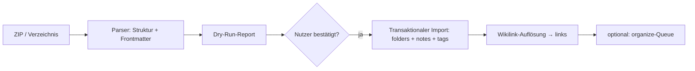

# 10 – Ausbauplanung (Post-MVP)

Dieses Dokument führt die in [09-roadmap.md](09-roadmap.md) gesammelten „Post-MVP-Ideen" zu einer umsetzbaren Ausbauplanung aus. Es setzt den **abgeschlossenen Vollausbau M0–M5** voraus und ist so detailliert wie die MVP-Planung, sodass jede Stufe einzeln und ohne weitere Konzeptarbeit startbar ist.

## Leitprinzipien des Ausbaus

1. **Rückwärtskompatibel:** Jede Stufe ist additiv. Bestehende Daten, Endpunkte und die „läuft-auch-ohne-KI"-Garantie (F-35, NF-03) bleiben unangetastet.
2. **Grundsatzentscheidungen respektieren:** Single-User, lokal, SQLite (E1/E2) bleiben. Keine Stufe führt Accounts, Cloud oder Kollaboration ein – das sind bewusste Nicht-Ziele ([01](01-vision-und-scope.md)). Stufen, die daran rühren, sind explizit als „nicht geplant" markiert.
3. **Eine Datei pro Anbieterwechsel:** Neue externe Dienste (Embeddings, Bilder) laufen über dieselbe gekapselte Provider-Schicht wie die Claude-API (E3) – Austausch bleibt lokal begrenzt.
4. **Unabhängig priorisierbar:** Die Stufen A–E haben keine harten Abhängigkeiten untereinander (Ausnahme notiert). Reihenfolge ist eine Empfehlung, keine Vorgabe.

## Überblick der Ausbaustufen

| Stufe | Thema | Kern-Nutzen | Aufwand | Neue Kosten | Abhängig von |
|---|---|---|---|---|---|
| **A** | Embedding-Index für Verknüpfungen | bessere, semantische Verknüpfungsvorschläge | ≈ 2–3 Tage | gering (Embedding-Tokens) oder 0 (lokal) | M3 |
| **B** | Obsidian-/Markdown-Import | Umstieg von bestehenden Sammlungen | ≈ 2 Tage | 0 (KI optional) | M1 |
| **C** | Wochen-Impuls (Zeitplan) | proaktiver Kreativ-Anstoß | ≈ 1 Tag | wie eine Agent-Nachricht/Woche | M4 |
| **D** | KI-Bildgenerierung als Agent-Tool | visuelle Moodboards/Illustrationen | ≈ 2 Tage | mittel (Bild-API pro Bild) | M4 |
| **E** | Tauri-Desktop-App | echtes App-Gefühl, Autostart, Offline-Bundle | ≈ 2–3 Tage | 0 | M5 |

Empfohlene Reihenfolge nach Nutzen/Aufwand: **A → B → C → E → D**.

Neue Feature-IDs schließen an den MVP-Katalog ([02](02-anforderungen.md), F-01…F-52) an und beginnen bei **F-60**.

---

## Stufe A – Embedding-Index für Verknüpfungen (F-60)

Löst „Stufe 2" aus [06-ki-features.md](06-ki-features.md), Abschnitt 2 ein: ersetzt die rein heuristische Kandidaten-Vorauswahl in `linker.ts` durch semantische Ähnlichkeit. Die Schnittstelle von `linker.ts` bleibt **identisch** – nur die Kandidatenbeschaffung ändert sich.

### Motivation

Die MVP-Heuristik (FTS-Titelwörter + Tag-Überschneidung + gleicher Ordner) findet nur lexikalisch/strukturell Nahes. Notizen, die dasselbe meinen, aber andere Wörter benutzen („Kompost" ↔ „Bodenaufbereitung"), werden übersehen. Embeddings schließen diese Lücke.

### Grundsatzentscheidung E5: Embedding-Provider

- **Standardwahl:** lokal via `@xenova/transformers` (`multilingual-e5-small`, ~470 MB Modell, CPU-tauglich). **Keine zusätzlichen API-Kosten, keine Daten verlassen den Rechner** – passt zur Privatsphäre-Entscheidung E2.
- **Alternative (per Einstellung):** gehosteter Embedding-Dienst (z. B. Voyage `voyage-3-lite`) für höhere Qualität bei vielen Notizen; erfordert Key, Kosten ~Bruchteil eines Cents pro Notiz.
- **Kapselung:** neue Datei `server/src/ai/embeddingProvider.ts` mit `embed(texts: string[]): Promise<Float32Array[]>` – analog zu `provider.ts` die einzige Stelle mit Embedding-SDK.

### Datenmodell (Migration 0002)

```sql
-- Ein Vektor je Notiz, erzeugt aus title + summary (fällt auf content zurück, wenn summary NULL)
CREATE TABLE note_embeddings (
    note_id    TEXT PRIMARY KEY REFERENCES notes(id) ON DELETE CASCADE,
    vector     BLOB NOT NULL,          -- Float32Array, little-endian
    dim        INTEGER NOT NULL,       -- Vektordimension (Modellwechsel erkennbar)
    model      TEXT NOT NULL,          -- z. B. 'e5-small' | 'voyage-3-lite'
    source_hash TEXT NOT NULL,         -- Hash von (title+summary); Neuberechnung nur bei Änderung
    created_at INTEGER NOT NULL
);
```

- **Kein Vektor-Index nötig:** Bei Single-User-Größenordnung (Ziel bis ~10 000 Notizen) genügt ein linearer Cosine-Scan im Speicher (< 20 ms für 10 000 × 384 Dim). Kein `sqlite-vss`/Extension-Zwang → Deployment bleibt „eine Datei".
- **Modellwechsel:** Weicht `model`/`dim` vom aktuell konfigurierten ab, gilt der Vektor als veraltet und wird neu berechnet (Hintergrund-Reindex).

### Ablauf

1. **Erzeugung:** Am Ende jedes erfolgreichen `organize`-Laufs (nachdem `summary` feststeht) wird `note_embeddings` für die Notiz aktualisiert, falls `source_hash` sich geändert hat. Kein Extra-Trigger für den Nutzer.
2. **Kandidatensuche:** `linker.ts` ruft neu `embeddingService.nearest(noteId, k=30)` statt der FTS/Tag-Heuristik. Ergebnis speist unverändert den bestehenden Bewertungs-Aufruf an Claude (max. 5 Vorschläge). **Der Prompt und das Tool-Schema `verknuepfungs_vorschlaege` bleiben unverändert.**
3. **Fallback:** Fehlt ein Embedding (KI war aus, alte Notiz), greift automatisch die alte Heuristik – kein harter Bruch. Ein Hintergrund-Job „Reindex fehlender Embeddings" füllt Lücken auf.

### API (additiv)

| Methode & Pfad | Zweck |
|---|---|
| `POST /notes/:id/similar` | „Ähnliche Notizen" für die UI (Panel), rein Embedding-basiert, ohne Claude-Aufruf → `{ results: [{ noteId, title, score }] }` |
| `POST /maintenance/reindex-embeddings` | Vollständiger Neuaufbau (nach Modellwechsel); antwortet mit Fortschritt via SSE |

Neue Einstellung: `embedding_provider` (`local` \| `voyage`), `embedding_model`. In `GET /settings` gespiegelt.

### Aufgaben & DoD

- [ ] `embeddingProvider.ts` (lokal + gehostet), `embeddingService.ts` (Speichern, Cosine-Suche, Reindex)
- [ ] Migration 0002 (`note_embeddings`)
- [ ] `linker.ts` auf `embeddingService.nearest()` umstellen, Heuristik als Fallback behalten
- [ ] `POST /notes/:id/similar` + „Ähnliche Notizen"-Panel im Editor
- [ ] Reindex-Job + Einstellungen (Provider/Modell)
- [ ] Tests: Cosine-Suche deterministisch (fixe Vektoren), Fallback bei fehlendem Embedding, Reindex nach Modellwechsel

**DoD:** Verknüpfungsvorschläge erfassen nachweislich semantisch verwandte, lexikalisch unähnliche Notizen (Test mit kuratiertem Beispielpaar); ohne KI-Key funktioniert alles wie zuvor.

---

## Stufe B – Obsidian-/Markdown-Import (F-61)

Ermöglicht den Umstieg von einer bestehenden Markdown-Sammlung (Obsidian-Vault, Notizordner, Export aus anderen Tools) ohne Copy-&-Paste.

### Scope

- Import eines **ZIP** oder eines **Server-Verzeichnispfads** mit `.md`-Dateien.
- **Ordnerstruktur** der Dateien → `folders`-Baum (1:1 übernommen, `UNIQUE(parent_id, name)` beachtet).
- **Dateiname/`# H1`** → Notiztitel; Dateiinhalt → `content`.
- **Frontmatter** (YAML) wird geparst: `tags:` → Tags (`origin='manual'`), unbekannte Felder landen als Kommentarblock am Notizende (nichts geht verloren).
- **`[[Wikilinks]]`** im Inhalt → nach dem Import in `links` mit `origin='wikilink'` aufgelöst (gleicher Mechanismus wie F-14); nicht auflösbare Ziele bleiben als Text erhalten.
- **Optional:** „Nach Import automatisch organisieren" – reiht importierte Notizen in die bestehende `organize`-Warteschlange ein (Tags/Summary/Verknüpfungen). Aus Kostengründen standardmäßig **aus** und mit Mengen-Warnung („500 Notizen ≈ 5–10 €").

### Nicht im Scope

- Obsidian-spezifische Plugins/Canvas/Dataview-Syntax (bleibt als Rohtext erhalten, wird nicht interpretiert).
- Bilder/Anhänge – erst mit Stufe D (`attachments`) sinnvoll; bis dahin werden Einbettungen als Markdown-Link belassen.

### Ablauf & Architektur

Neuer `importService.ts` (Service-Schicht, kein KI-Modul):



- **Dry-Run zuerst (Pflicht):** `POST /import/analyze` liefert einen Report (Anzahl Ordner/Notizen, Namenskollisionen, geschätzte Größe, geschätzte KI-Kosten falls Auto-Organisieren gewählt) **ohne** zu schreiben. Erst `POST /import/commit` schreibt – in **einer** Transaktion (alles oder nichts).
- **Kollisionsstrategie:** `merge` (in bestehende gleichnamige Ordner einsortieren) \| `prefix` (Import unter neuem Wurzelordner „Import <Datum>"). Default `prefix` – nicht-destruktiv.

### API (additiv)

| Methode & Pfad | Zweck |
|---|---|
| `POST /import/analyze` | Multipart-ZIP **oder** `{ path }` → Dry-Run-Report, schreibt nicht |
| `POST /import/commit` | `{ token, strategy, autoOrganize }` → führt Import aus (`token` aus dem Analyse-Schritt, bindet Ergebnis) |

### Aufgaben & DoD

- [ ] `importService.ts`: ZIP-/Verzeichnis-Parser, YAML-Frontmatter, Struktur→Ordner, transaktionaler Commit
- [ ] Wikilink-Auflösung als wiederverwendbare Funktion (teilt Logik mit F-14)
- [ ] `POST /import/analyze` + `/import/commit`, Zod-Verträge in `shared/`
- [ ] Import-Dialog in `settings/`: Datei wählen → Report → Strategie → Bestätigen → Fortschritt
- [ ] Tests: Beispiel-Vault (verschachtelt, Frontmatter, Wikilinks, Kollision) → korrekte Bäume/Links; Rollback bei Fehler mitten im Import

**DoD:** Ein realer Obsidian-Vault mit Unterordnern, Tags und `[[Links]]` landet strukturtreu in der App; ein zweiter Import desselben Vaults dupliziert nichts (Strategie greift); Abbruch hinterlässt keine halben Daten.

---

## Stufe C – Wochen-Impuls per Zeitplan (F-62)

Realisiert F-46 („Wochen-Impuls") als **automatischen** proaktiven Anstoß, statt ihn nur manuell über den „Ideen-Funke" auszulösen.

### Verhalten

- Ein serverseitiger Scheduler (leichter In-Process-Cron, z. B. `node-cron`; kein externer Dienst) läuft nach konfigurierbarem Plan (Default: Montag 08:00 Ortszeit).
- Er ruft denselben Mechanismus wie `POST /agent/spark` mit Scope „alle" und `recentDays: 7` auf und legt das Ergebnis als **fertige Agent-Session** an (Titel „Wochen-Impuls – KW <n>").
- **Kein Push, keine E-Mail** (Single-User, lokal – E2). Stattdessen: beim nächsten Öffnen der App zeigt ein dezenter Indikator „1 neuer Impuls" am Agent-Panel. Ungelesene Impulse sammeln sich in der Session-Liste.
- **Nur wenn KI aktiv** (`ai_enabled` + Key) und seit dem letzten Impuls neue/geänderte Notizen existieren (sonst übersprungen – keine Leerläufe, keine unnötigen Kosten).

### Datenmodell (Migration 0003)

Keine neue Tabelle nötig – Wiederverwendung von `chat_sessions` mit Markierung:

```sql
ALTER TABLE chat_sessions ADD COLUMN origin TEXT NOT NULL DEFAULT 'user'
    CHECK (origin IN ('user','weekly_impulse'));
ALTER TABLE chat_sessions ADD COLUMN seen_at INTEGER;   -- NULL = ungelesen (für den Indikator)
```

Scheduler-Zustand (letzter Lauf) liegt als `settings`-Key `weekly_impulse_last_run`.

### API (additiv)

| Methode & Pfad | Zweck |
|---|---|
| `GET /agent/sessions?origin=weekly_impulse` | Impuls-Historie |
| `POST /agent/sessions/:id/seen` | Als gelesen markieren (Indikator zurücksetzen) |
| Einstellung `weekly_impulse_enabled`, `weekly_impulse_cron` | in `GET/PUT /settings` |

### Aufgaben & DoD

- [ ] Scheduler-Modul `server/src/scheduler.ts` (startet in `index.ts`, no-op ohne KI)
- [ ] Impuls-Lauf: Spark-Mechanismus wiederverwenden, Session mit `origin='weekly_impulse'` persistieren, Skip-Logik (keine Änderungen → kein Lauf)
- [ ] „Neuer Impuls"-Indikator + Ungelesen-Zustand im Agent-Panel
- [ ] Einstellungen (an/aus, Zeitplan, Zeitzone)
- [ ] Tests: Scheduler mit gemockter Zeit löst genau einmal aus; Skip ohne Änderungen; kein Lauf ohne Key

**DoD:** Montagmorgens liegt (bei Aktivität in der Vorwoche) ein lesbarer Impuls bereit; ohne neue Notizen passiert nichts; Funktion vollständig abschaltbar.

---

## Stufe D – KI-Bildgenerierung als Agent-Tool (F-63)

Löst die in [06-ki-features.md](06-ki-features.md) („Optionale Erweiterung") und E4 vorgesehene Bildgenerierung ein: Der Kreativ-Agent kann auf Wunsch Illustrationen/Moodboards erzeugen und als Anhang einer Notiz speichern.

### Scope

- Neues Agent-Tool `create_image(prompt, style?)` analog zu `create_diagram`. Erzeugt ein Bild über einen gekapselten Bild-Provider, sendet ein `image`-SSE-Event, rendert es inline im Chat mit „Als Notiz speichern".
- Bilder werden als **Datei** unter `DATA_DIR/attachments/` abgelegt (nicht als BLOB in der DB – hält die DB schlank, Backup = Ordner mitkopieren) und in einer `attachments`-Tabelle referenziert.
- **Streng nutzergetrieben:** wie beim übrigen Agenten schreibt nichts automatisch ins Notizsystem; „Als Notiz speichern" hängt das Bild an eine neue oder gewählte Notiz.

### Grundsatzentscheidung E6: Bild-Provider

- **Kapselung:** `server/src/ai/imageProvider.ts` mit `generate(prompt, opts): Promise<{ bytes, mime }>` – einzige Stelle mit Bild-API-SDK.
- **Standardwahl:** ein gehosteter Bild-API-Anbieter (Key erforderlich, eigener Einstellungs-Slot `image_api_key`, getrennt vom Text-Key). **Kosten pro Bild** – deshalb harte Obergrenze pro Tag (`image_daily_limit`, Default 20) und Kostenanzeige.
- **Ohne Bild-Key:** Tool ist deaktiviert, Agent weiß das (Systemprompt-Hinweis) und schlägt stattdessen ein Mermaid-Diagramm vor. Der restliche Agent bleibt voll funktionsfähig.

### Datenmodell (Migration 0004)

```sql
CREATE TABLE attachments (
    id         TEXT PRIMARY KEY,
    note_id    TEXT REFERENCES notes(id) ON DELETE CASCADE,  -- NULL = nur im Chat, noch nicht gespeichert
    kind       TEXT NOT NULL CHECK (kind IN ('image')),
    path       TEXT NOT NULL,          -- relativ zu DATA_DIR/attachments/
    mime       TEXT NOT NULL,
    prompt     TEXT,                   -- Erzeugungs-Prompt (Nachvollziehbarkeit)
    width      INTEGER, height INTEGER,
    created_at INTEGER NOT NULL
);
CREATE INDEX idx_attachments_note ON attachments(note_id);
```

- **Aufräum-Job:** Anhänge mit `note_id IS NULL`, die älter als 24 h sind (im Chat erzeugt, nie gespeichert), werden samt Datei gelöscht – analog zum Papierkorb-Job.
- **Markdown-Einbettung:** Beim Speichern wird `` in den Notizinhalt eingefügt; der Editor rendert lokale Anhänge.

### API (additiv)

| Methode & Pfad | Zweck |
|---|---|
| `GET /attachments/:id` | Bild ausliefern (mit Cache-Header) |
| `POST /agent/messages/:id/save-image` | Chat-Bild an Notiz hängen (setzt `note_id`, fügt Markdown ein) |
| Neues SSE-Event `image` | `data: {"attachmentId": "...", "url": "/api/attachments/...", "prompt": "..."}` |

Sicherheit: `attachments/:id` liefert nur aus `DATA_DIR/attachments/` (Pfad-Traversal ausgeschlossen), Server bleibt an `127.0.0.1` gebunden.

### Aufgaben & DoD

- [ ] `imageProvider.ts`, Ablage-Service (Datei schreiben, Pfad sichern), Migration 0004
- [ ] Agent-Tool `create_image` + `image`-SSE-Event + Tageslimit/Kostenzähler
- [ ] Chat-Rendering des Bildes + „Als Notiz speichern"; Editor rendert `/api/attachments/…`
- [ ] Aufräum-Job für verwaiste Anhänge; separater Bild-Key in Einstellungen
- [ ] Tests: Tool-Loop mit gemocktem Bild-Provider, Tageslimit greift, Pfad-Traversal abgewehrt, verwaiste-Anhänge-Job

**DoD:** Der Agent erzeugt auf Wunsch ein Bild, das inline erscheint und als Anhang an einer Notiz gespeichert werden kann; ohne Bild-Key ist alles Übrige unbeeinträchtigt; die DB bleibt schlank (Bilder als Dateien).

---

## Stufe E – Tauri-Desktop-App (F-64)

Verpackt den bestehenden React-Client als native Desktop-App – die E1-Alternative, ohne die Codebasis zu spalten.

### Motivation & Ansatz

- Echtes App-Fenster, Dock-/Startmenü-Eintrag, Autostart-Option, kein „im-Browser-Tab-verloren".
- **Gleiche Codebasis:** Tauri lädt denselben Vite-Client. Zwei Betriebsmodi für den Server:
  - **Sidecar (Standard):** Tauri startet den Node-Server als mitgeliefertes Sidecar-Binary (via `pkg`/`node --sea`), Fenster zeigt `http://127.0.0.1:<port>`. Kein separates Terminal, ein Doppelklick.
  - **Attach:** verbindet sich mit einem bereits laufenden `npm start` (für Entwicklung/Heimserver).
- **Kein Rust-Anwendungscode nötig** außer der Tauri-Konfiguration und dem Sidecar-Start-Hook.

### Projektstruktur (additiv)

```
notes-app/
└── desktop/                    # @notes/desktop – Tauri-Wrapper
    ├── src-tauri/
    │   ├── tauri.conf.json      # Fenster, Sidecar, Icons, Updater (aus)
    │   ├── Cargo.toml
    │   └── src/main.rs          # Sidecar-Start, Port-Wahl, Graceful-Shutdown
    └── package.json             # baut client + server-sea, dann tauri build
```

Neue Root-Skripte: `desktop:dev` (Tauri im Dev-Modus gegen Vite), `desktop:build` (Client + Server-Binary + Bundle je OS).

### Betriebs-/Sicherheitsaspekte

- Server bleibt an `127.0.0.1` (unverändert). Tauri-`allowlist` minimal: nur Shell-Sidecar + FS-Zugriff auf `DATA_DIR`.
- **Datenablage:** `DATA_DIR` zeigt im Desktop-Betrieb auf das OS-App-Data-Verzeichnis (`~/Library/Application Support/notes-app`, `%APPDATA%\notes-app`, `~/.local/share/notes-app`) – dieselbe SQLite-Datei, damit CLI- und Desktop-Betrieb austauschbar bleiben.
- **Auto-Update:** im MVP-Ausbau **deaktiviert** (Single-User, lokal; manuelles Ersetzen des Bundles genügt) – vermeidet Signatur-/Update-Server-Aufwand.

### Aufgaben & DoD

- [ ] `desktop/`-Workspace mit Tauri-Konfiguration, Icons, Fenster-Defaults
- [ ] Server als Single-Executable bündeln (`node --sea` o. Ä.), als Tauri-Sidecar registrieren
- [ ] `main.rs`: freien Port wählen, Sidecar starten, beim Fenster-Schließen sauber beenden
- [ ] `DATA_DIR` auf OS-App-Data mappen; Migrationspfad aus bisherigem `./data` dokumentieren
- [ ] Build-Pipeline `desktop:build` für mind. eine Zielplattform verifiziert
- [ ] Manueller Test: Doppelklick startet App, Daten bleiben nach Neustart erhalten, sauberes Beenden ohne verwaiste Node-Prozesse

**DoD:** Ein installierbares Desktop-Bundle startet Server + UI mit einem Doppelklick, nutzt dieselbe SQLite-Datei wie der CLI-Betrieb und beendet den Sidecar sauber. Web-/CLI-Betrieb bleibt unverändert möglich.

---

## Bewusst nicht geplante Erweiterungen

Diese wären technisch möglich, widersprechen aber den Grundsatzentscheidungen und bleiben **Nicht-Ziele**, bis eine Entscheidung sie explizit revidiert:

| Idee | Kollidiert mit | Was es bräuchte |
|---|---|---|
| Cloud-Sync / Multi-Device | E2 (lokal, Single-User) | Server mit Account/Auth, Konfliktauflösung (CRDT), gehostete DB – Neuentwurf von [03](03-architektur.md)/[04](04-datenmodell.md) |
| Kollaboration (Freigaben, Kommentare) | Nicht-Ziel „Single-User" ([01](01-vision-und-scope.md)) | Mehrbenutzer-Modell, Rechte, Echtzeit-Sync |
| Native Mobile-App | Nicht-Ziel „nur Web/PWA" | separates RN/Flutter-Frontend oder Capacitor-Wrapper |

Falls eine davon doch gewünscht wird, ist der ehrliche Weg ein neues Vision-Kapitel mit revidierten Entscheidungen (E2 kippen) – nicht ein Anflanschen an diese Planung.

## Auswirkungen auf bestehende Dokumente

Bei Umsetzung einer Stufe sind folgende Dokumente fortzuschreiben:

- **A:** [04](04-datenmodell.md) (`note_embeddings`), [05](05-api-spezifikation.md) (`/similar`), [06](06-ki-features.md) (Stufe-2-Abschnitt als „umgesetzt" markieren).
- **B:** [05](05-api-spezifikation.md) (`/import/*`), [08](08-projektstruktur.md) (`importService.ts`).
- **C:** [04](04-datenmodell.md) (`chat_sessions.origin/seen_at`), [08](08-projektstruktur.md) (`scheduler.ts`).
- **D:** [04](04-datenmodell.md) (`attachments`), [05](05-api-spezifikation.md) (`/attachments`, `image`-Event), [06](06-ki-features.md) (Bild-Provider), [03](03-architektur.md) (Sicherheits-Tabelle: statische Anhänge).
- **E:** [03](03-architektur.md)/[08](08-projektstruktur.md) (`desktop/`-Workspace, Betriebsmodi), [01](01-vision-und-scope.md) (E1 um „Desktop umgesetzt" ergänzen).

Jede Stufe endet mit grünem `npm run lint && npm test` und einem aktualisierten README-Statusabschnitt.
